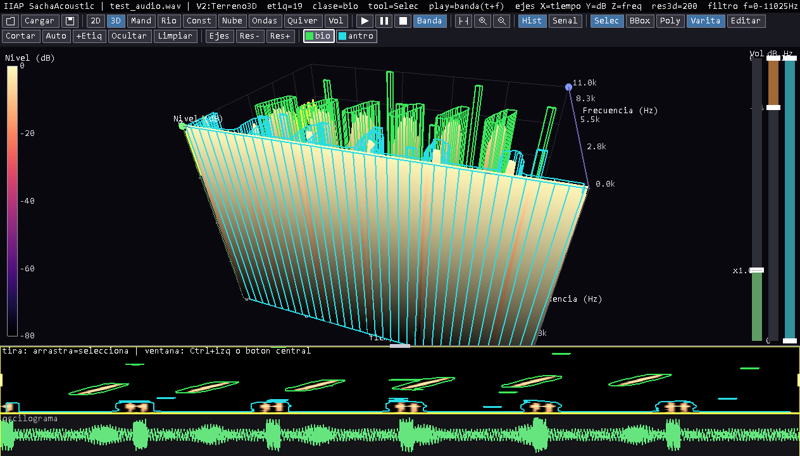
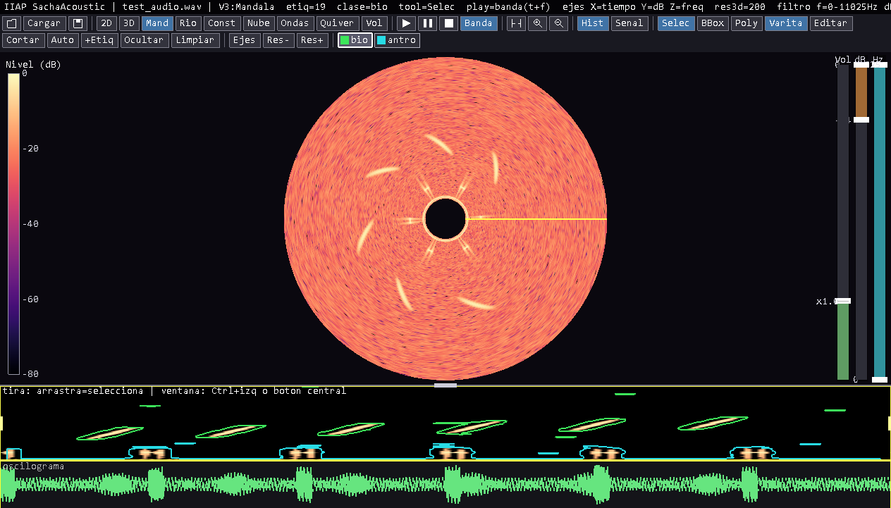
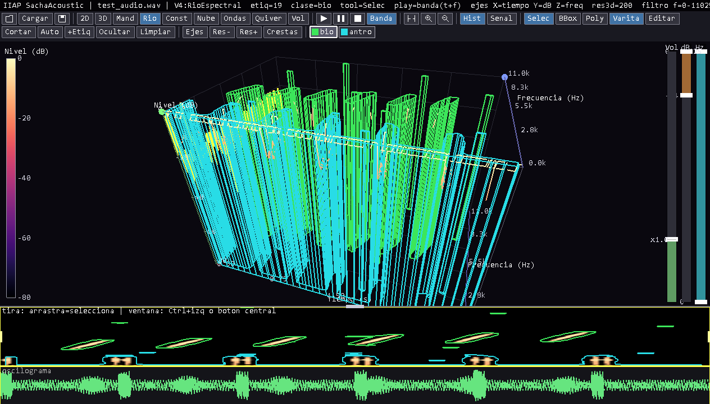
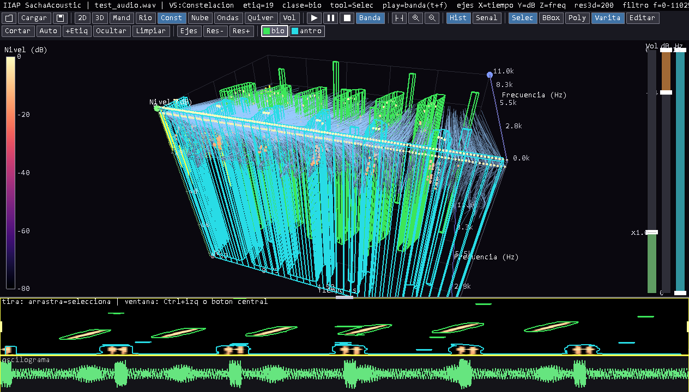
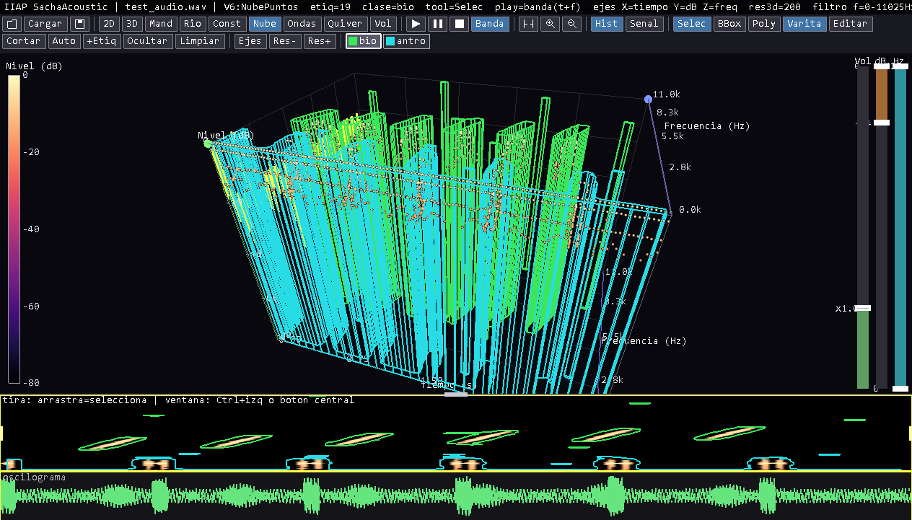
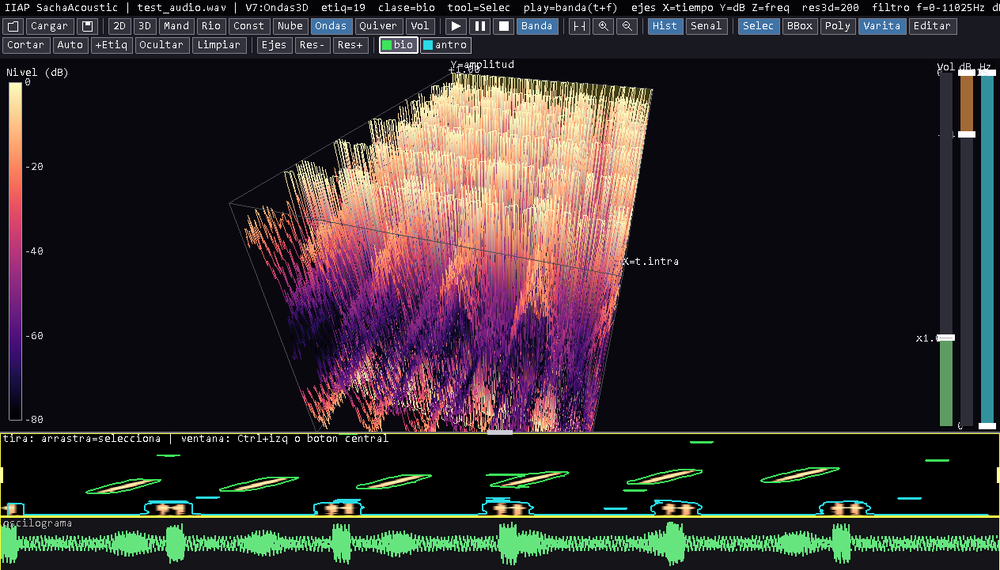
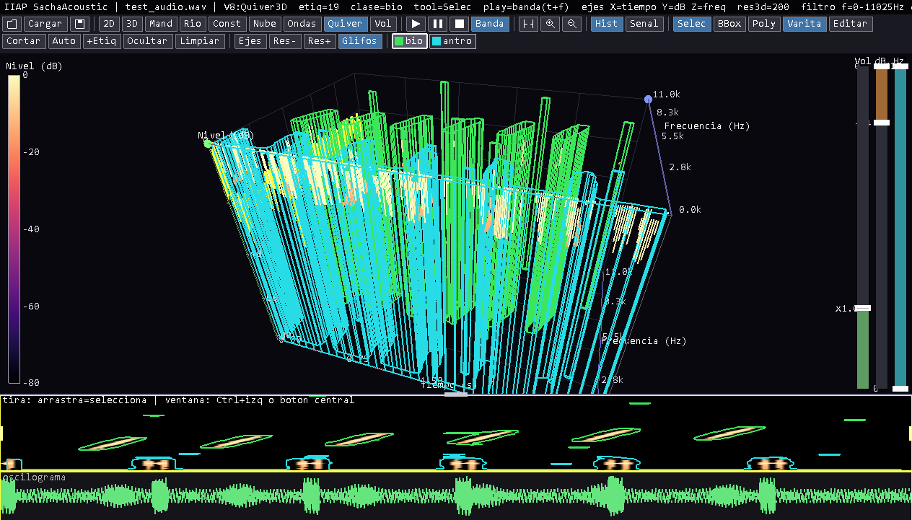
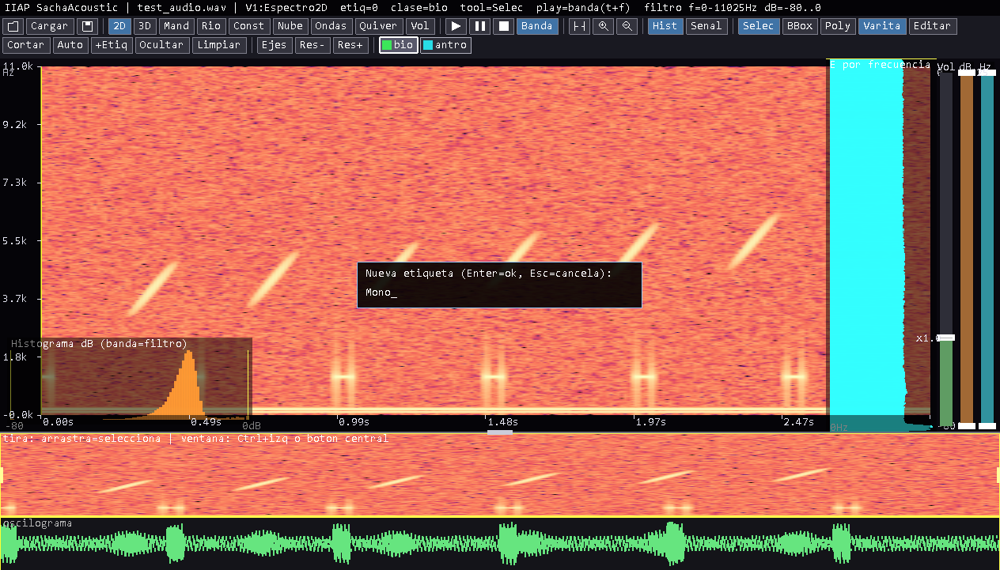
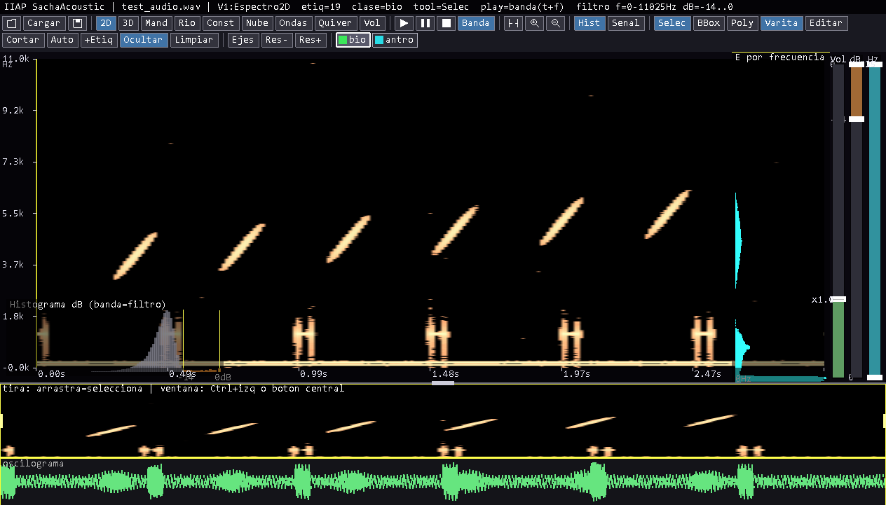

# IIAP SachaAcoustic

**Software de análisis de audio para bioacústica**, pensado para **apoyar la generación
de datos de entrenamiento para algoritmos de inteligencia artificial**. Permite abordar
**distintos tipos de análisis** de una grabación combinando: **filtros a nivel de
decibeles y de frecuencia**, **etiquetado** de los eventos de interés, y **visualización
2D y 3D** para **entender mejor la distribución de la señal** que se va a analizar.

El flujo es: cargar audio WAV → calcular el espectrograma → realzarlo con un método
**fiel** (no destructivo) → explorar la señal con **9 vistas** (2D + visualizaciones 3D
originales), filtros por barras y navegación temporal → **etiquetar** (por **polígono**
o **caja**, manual o automático) → **exportar** un conjunto de datos en formato **COCO**
(detección + segmentación) y **Raven** (selection table), listo para entrenar modelos.

Las etiquetas quedan **asociadas al audio**: al volver a abrir un archivo, si en la
carpeta de salida existe su conjunto de etiquetas, se **cargan automáticamente**.

Aplicación nativa de Windows escrita en C++ con OpenGL, **sin dependencias externas**.

{ width=96px }

---

## Índice

1. Instalación y compilación
2. El proceso de realce (cómo se construye la imagen)
3. Disposición de la interfaz
4. Las 9 vistas (2D + 3D)
5. Filtros (barras de frecuencia / dB) y volumen
6. Navegación temporal y **zoom 2D**
7. Reproducción
8. Etiquetado (clases, herramientas, editar/cortar, auto, autosave, carga)
8 bis. Protocolo de etiquetado (con señal a 14 dB)
8 ter. Fundamento científico (matemático, físico, ecológico)
9. Referencia de cursores
10. Resumen de teclas
11. Formatos y estructura
12. Referencias

---

## 1. Instalación y compilación

### Requisitos
- Windows 10/11.
- Para compilar: **w64devkit** (g++ ≥ 13, `windres`) — toolchain portátil, sin instalación.

### Compilar
```bat
cd etiquetador_cpp
build.bat
```
Genera `IIAP_SachaAcoustic.exe` (workstation), `etiquetador.exe` (etiquetador 2D
simple) y `cli.exe` (prueba sin ventana). También con `make`. Cierra la aplicación
antes de recompilar para no bloquear el `.exe`.

### Ejecutar
```bat
IIAP_SachaAcoustic.exe  [audio.wav]  [carpeta_salida]
```
Si no se indica WAV, ábrelo con el botón **Abrir** (icono de carpeta) o la tecla `o`.
Formatos: WAV mono/estéreo, PCM 16/24/32 bits o float32 (se mezcla a mono).
**Al cargar no se autoetiqueta**; pero si en la **carpeta de salida** ya existe
`<nombre_audio>.json` (un guardado COCO previo), esas etiquetas **se cargan
automáticamente** (con sus polígonos/cajas y clases).


---

## 2. El proceso de realce (cómo se construye la imagen)

1. **STFT**: ventana Hann (`nfft=1024`, `hop=256`), FFT propia → magnitud en dB
   `[1,2]`.
2. **Normalización** con rango dinámico fijo (80 dB bajo el máximo) → energía en `[0,1]`.
3. **Realce FIEL (asinh)**: transformación **monótona** (seno hiperbólico inverso) que
   levanta los sonidos débiles y comprime los fuertes **sin eliminar información**
   (a diferencia de PCEN, que normaliza por banda y distorsiona). Es la misma idea del
   *asinh stretch* usado para imágenes astronómicas con rango dinámico enorme `[5]`. Se
   eligió tras comparar 16 estrategias por entropía, contraste local, saturación y
   fidelidad.
4. **Colormap magma** para la visualización.

El **autoetiquetado** y los análisis de crestas se calculan sobre el espectro
**crudo** (donde la relación señal/ruido por banda es real), no sobre el realzado.

---

## 3. Disposición de la interfaz

```
┌───────────────────────────────────────────────────────────┐
│ Barra de estado: app | archivo | vista | clase | herram.   │
├───────────────────────────────────────────────────────────┤
│ Barra de botones por secciones (Archivo · Vistas ·          │
│   Reproducción · Navegación · Display · Etiquetado · 3D)    │
│   + PALETA de clases clicable                               │
├───────────────────────────────────────────────────────────┤
│   eje Hz                                            barras  │
│ │ │            VISTA PRINCIPAL (2D o 3D)            │ freq │ │
│ │ │                                                 │ dB   │ │
│   eje s                                             │ Vol  │ │
├───────────────────────────────────────────────────────────┤  ← manija de altura
│ NAVEGADOR: tira de espectrograma + ventana con manijas      │
│ Oscilograma (forma de onda, todo el audio)                  │
└───────────────────────────────────────────────────────────┘
```

La **barra de estado** muestra el archivo, la vista, la **clase activa**, la
**herramienta** activa y los rangos de los filtros. El espectro 2D se dibuja con
**márgenes** (eje de frecuencia a la izquierda, eje de tiempo abajo, barras a la
derecha) para poder etiquetar también en los bordes.

---

## 4. Las 9 vistas

| Tecla | Vista | Descripción |
|---|---|---|
| `1` | **Espectrograma 2D** | Imagen tiempo–frecuencia; superficie de etiquetado, ejes e histograma. |
| `2` | **Terreno 3D** | El espectrograma como relieve; altura = energía. |
| `3` | **Mandala radial** | Tiempo = ángulo, frecuencia = radio; los ritmos se vuelven simetrías. |
| `4` | **Río espectral** | Crestas tonales seguidas en el tiempo como hilos 3D. |
| `5` | **Constelación armónica** | Picos como puntos 3D + líneas que unen familias armónicas. |
| `6` | **Nube de puntos** | Cada celda como punto 3D; opacidad por energía. |
| `7` | **Ondas 3D** | Cascada de formas de onda sucesivas. |
| `8` | **Quiver3D** | Por cada hilo, palos verticales entre la envolvente de valles y la curva de crestas. |
| `9` | **Volumen** | Nube de puntos densa por etiqueta: cada punto = dB real en (tiempo, frecuencia). |

**Ejes 3D (ortoedro)**: la escena 3D es un **ortoedro** con rejilla en el piso y las
paredes del fondo (estilo gráfico científico), con **títulos** y **valores reales** por
eje, repartidos en aristas concretas:

- **Tiempo (s)** → **arista inferior del frente** (0 a la izquierda).
- **Frecuencia (Hz)** → **arista inferior derecha** (hacia el fondo) **y** también en la
  **arista superior derecha**; su **0 está en el vértice común con Tiempo** (frente-derecha).
- **Nivel (dB)** → **arista vertical frontal izquierda** (la altura = energía), con su
  **barra de color "Nivel (dB)"** a la izquierda.

Las vistas 3D **encuadran exactamente lo que dejan pasar las barras de filtro**, en
**ambos ejes**: el **eje de Nivel (dB)** abarca la **banda de dB del filtro** más un
**margen de 5 dB** (p. ej. si el piso está en −63 dB, el eje empieza en −68 dB), y el
**eje de Frecuencia** abarca la **banda de frecuencia del filtro** más un **margen de
1000 Hz**. Solo se dibuja el relieve dentro de esa banda de dB y de frecuencia, así que
mover las barras **acerca/encuadra** la zona de interés en 3D. (Es **solo
visualización**; **no** modifica el sonido. La barra de color "Nivel (dB)" mantiene el
rango absoluto porque el **color** codifica el dB real.)

La **vista inicial** es una perspectiva de ortoedro (frontal y algo elevada). El botón
**Ejes** (`r`) intercambia tiempo ↔ frecuencia en el piso (dB siempre vertical). El
**playhead** es una línea sobre la frecuencia. Las etiquetas se dibujan en 3D **tal
cual**: las **cajas** como prismas y los **polígonos** con su contorno real extruido
(distinguibles entre sí). El cubo tiene **manijas** en los extremos de cada eje para
redimensionarlo.

















---

## 5. Filtros (barras) y volumen

A la **derecha** del espectro hay tres **barras verticales** con manijas arrastrables
que actúan **en vivo** sobre **todas** las vistas, la tira 2D **y la reproducción**:

| Barra | Manijas | Acción |
|---|---|---|
| **Frecuencia** (extremo derecho) | superior + inferior | Banda de frecuencia `[fLo, fHi]` |
| **dB** | superior + inferior | Banda de energía `[piso, techo]` |
| **Vol** (ganancia) | una manija | Volumen de reproducción (0–4×; >1 sube por encima del nivel normalizado) |

En el espectrograma, los píxeles fuera de banda se oscurecen (la imagen refleja el
filtro). En la reproducción se aplica un enmascarado STFT + reconstrucción
(overlap-add): **suena solo lo que se ve** —noción de **máscara binaria
tiempo–frecuencia** `[6,7]`. El botón **Hist** superpone el histograma de frecuencia
(lateral) y de dB (inferior), con las bandas del filtro resaltadas. La vista **Volumen**
tiene su **propio juego de barras** (Frecuencia, dB, Vol) que **solo afecta a esa vista**
(filtros locales); en las demás vistas las barras son globales. En la vista Volumen, la
**reproducción del sonido** usa esos filtros locales **y se limita a lo que está DENTRO de
las etiquetas** (suena solo la señal contenida en las etiquetas, en la banda de
dB/frecuencia que ves en 3D).

**Filtrado en tiempo real:** si mueves las barras de **dB** o **frecuencia** (o usas sus
teclas) **mientras se está reproduciendo**, el cambio se **aplica al sonido en vivo** —se
re-genera el audio desde la posición actual del *playhead* con el nuevo filtro, sin
detener la reproducción—.

---

## 6. Navegación temporal (ventana)

El **navegador inferior** muestra todo el audio. El **cuadro de ventana** (recuadro
amarillo con manijas) define qué porción se ve.

- **Manijas de los bordes** (cursor 🖐): arrastrar para **agrandar/achicar** la ventana.
- **Mover la ventana**: **botón central** del ratón o **Ctrl + clic izquierdo** dentro del cuadro.
- Botones **Ver todo** (ajustar), **Zoom +**, **Zoom −**.
- **Manija de altura**: el divisor superior del panel inferior sube/baja la tira + oscilograma.

### Zoom de la vista 2D (tiempo + frecuencia)
En la vista **Espectrograma 2D** puedes **acercar/alejar en ambos ejes** (tiempo *y*
frecuencia) para colocar o mover con precisión los puntos de los polígonos:

- **Rueda del ratón** sobre el espectro: zoom **hacia el cursor**.
- Botones **Zoom +** / **Zoom −** (lupa) y **Ver todo** (restablece tiempo y frecuencia).

Los **ejes** (s y Hz) y todas las etiquetas se reescalan al área visible.

---

## 7. Reproducción


| Botón / Tecla | Acción |
|---|---|
| ▶ / `Espacio` | Reproducir **la ventana visible** |
| ⏸ / `k` | Pausar / reanudar |
| ⏹ / `.` | Detener |
| **Banda** | Reproduce **solo la banda** (tiempo + frecuencia) de la selección |

La **línea de reproducción (playhead)** amarilla avanza durante la reproducción y se
queda donde termina. Un **clic simple** sobre el navegador o el espectro reposiciona el
playhead (seek). El volumen se ajusta con la barra **Vol**. Cada fragmento se reproduce
con una **rampa de entrada/salida** corta, de modo que **no se oye el "golpe"/click** al
empezar ni al terminar. Los filtros de dB/frecuencia se pueden **mover en vivo** y se
aplican al instante sobre lo que está sonando (ver §5).

---

## 8. Etiquetado

### Clases dinámicas
Las clases se crean a voluntad. Por defecto existen **bio** (verde) y **antro** (cian).
La **paleta** de la barra (con muestra de color y nombre) selecciona la **clase activa**
con un clic. Para **crear una etiqueta nueva** pulsa **+Etiq** (`N`) y escribe el nombre
(Enter = aceptar, Esc = cancelar); también desde el menú contextual *Nueva etiqueta…*.



### Herramientas (formas de etiquetar)
La forma de etiquetar es **polígono** o **bounding box**. Se elige en la barra:

| Tecla | Herramienta | Uso |
|---|---|---|
| `S` | **Selec** | Seleccionar/escuchar; clic = mueve playhead y selecciona etiqueta |
| `Y` | **BBox** | Arrastra un rectángulo → crea la caja de la clase activa |
| `P` | **Poly** | Etiqueta polígono (ver varita) |
| `V` | **Varita** | En modo polígono, activa/desactiva la **varita mágica** |
| `E` | **Editar** | Mueve vértices del polígono / manijas de la caja |
| `X` | **Cortar** | **Corte libre** (ver abajo) |


- **Polígono con varita mágica (ON)**: un clic sobre la señal **crece la región conexa**
  y crea el polígono automáticamente.
- **Polígono a mano (varita OFF)**: cada clic añade un vértice; **clic derecho** o
  **Enter** cierra el polígono; **Esc** cancela.


### Editar y cortar
- **Editar** (`E`): primero **selecciona** una etiqueta (clic en su interior). Luego:
  - **Mover un vértice**: arrastra un **vértice** del polígono (o las **manijas** de una caja:
    4 esquinas + 4 lados). Arrastrar **dentro** de un polígono lo **mueve entero** (conserva
    su forma; no se convierte en caja).
  - **Agregar un punto**: **clic izquierdo SOBRE LA LÍNEA (arista)** del polígono, justo donde
    lo quieras; se inserta el vértice ahí y puedes arrastrarlo en el mismo gesto. Hacer clic
    **dentro** del polígono (no en la línea) **no agrega** ningún punto.
  - **Seleccionar varios vértices**: arrastra un **rectángulo con el botón DERECHO** sobre los
    vértices que quieras; quedan marcados en **rojo**. Un clic derecho simple marca el vértice
    más cercano.
  - **Quitar puntos**: pulsa **Supr** para borrar **todos los vértices marcados** (o un único
    vértice marcado). Si el polígono quedara con menos de 3 vértices, se borra la etiqueta.
  - Combínalo con el **zoom 2D** (rueda) para mayor precisión.
- **Cortar** (`X`) — **corte libre**: con el botón izquierdo **pintas el trazo** sobre la
  parte por donde quieres separar; con **clic derecho** se ejecuta el corte y la etiqueta
  se divide en dos piezas (cada una puede recibir otra clase). `Esc` limpia el trazo.

### Menú contextual (clic derecho)
- Sobre una **etiqueta**: *Reproducir etiqueta*, *Reproducir selección* (si hay), cambiar
  de **clase**, *Nueva etiqueta…*, *Borrar*, y para polígonos **Auto-mejorar etiqueta** y
  **Buffer…**.
- Sobre una **selección**: *Reproducir selección*, *Crear: <clase>*, **Borrar etiquetas en
  la selección (Supr)**, *Quitar selección*.
- En zona vacía: *Auto-etiquetar*, *Nueva etiqueta…*.

### Borrar con la herramienta Selec (`S`)
- **Borrar un vértice**: haz **clic sobre un vértice** de cualquier polígono (se marca en
  rojo) y pulsa **Suprimir (Supr)** para eliminar **solo ese vértice**. Si el polígono
  quedaría con menos de 3 vértices, se borra la etiqueta entera.
- **Borrar etiquetas por área**: arrastra una **caja de selección** (tiempo + frecuencia)
  sobre el espectro y pulsa **Supr**: se borran **todas las etiquetas cuyo centro queda
  dentro** de la caja. También por **clic derecho → "Borrar etiquetas en la selección"**.
- **Supr** prioriza el **vértice marcado**; si no hay ninguno, actúa sobre la selección o,
  en su defecto, sobre la etiqueta seleccionada.

### Auto-mejorar y Buffer (solo polígonos)
- **Auto-mejorar etiqueta**: re-segmenta **solo la región** de esa etiqueta sobre el
  espectro **filtrado** y reemplaza su contorno (conserva la clase).
- **Buffer…**: abre un modal con una **barra** para ajustar el *buffer* (suavizado/margen)
  y re-procesa el polígono en vivo (menos detalle y menos sub-etiquetas).

### Autoetiquetado
**Auto** (`a`) detecta sobre el espectro **filtrado** (respeta los filtros) y produce la
**forma activa** (polígono o caja). En modo polígono aplica un *buffer* de suavizado. El
detector combina un **umbral por banda** (`mediana + K·MAD`) `[3,4]` con un **umbral
global** (que capta las **bandas graves estacionarias**, que el umbral por fila no ve),
seguido de morfología y **componentes conexos** + trazado de contorno `[7]`.

### Otras
- **Ocultar** (`O`): muestra/oculta las etiquetas (2D y 3D).
- **Limpiar** (`c`): borra **todas** las etiquetas.
- **Guardar** (`s`): exporta `<audio>.json` (**COCO**: categorías dinámicas, bbox +
  segmentación, `kind`) y `<audio>.txt` (**Raven** selection table). En cada anotación
  COCO se guarda además el **umbral de dB de señal** (`signal_db_threshold`), el rango de
  frecuencia/dB y la frecuencia de muestreo.
- **Autoguardado (autosave)**: cualquier cambio en las etiquetas (crear, editar, mover,
  cortar, borrar, auto…) se **guarda solo** a los pocos segundos en `<audio>.json` +
  `<audio>.txt`, sin pulsar nada, y también **al cerrar** la aplicación. El botón
  **Guardar** sigue disponible (muestra el aviso); el autosave es silencioso.
- **Carga automática**: al abrir un audio, si existe `<audio>.json` en la carpeta de
  salida, sus etiquetas (polígonos/cajas y clases) **se cargan solas** —se retoma el
  trabajo donde quedó—. **Cargar** (`R`) importa además una selection table de **Raven**
  (`.txt`) y recrea las cajas (creando clases nuevas si hace falta).

---

## 8 bis. Protocolo de etiquetado (cómo etiquetar)

> **Regla general — extensión de la etiqueta:** *Etiquetar desde la frecuencia mínima
> visible hasta la frecuencia máxima donde la energía del sonido todavía sea claramente
> distinguible del ruido de fondo.*

Antes de marcar un sonido conviene saber **a qué frecuencias y a qué nivel (dB) es
entendible** —dónde deja de ser señal y pasa a ser ruido—. Esto es, operativamente,
buscar dónde la **relación señal/ruido** cae por debajo del umbral de detección `[8]`.
Ejemplo con un **valor de señal de 14 dB**:

**Paso 1 — Localiza el sonido.** Acércate con la ventana del navegador (zoom) para
aislarlo en el tiempo. El espectrograma muestra señal + ruido (figura del §1).

**Paso 2 — Baja el techo de dB y escucha.** Arrastra la manija superior de la barra de
**dB** (o `dBhi-`) y **reproduce** (`Espacio`) repetidamente. Al bajar el techo se quitan
los componentes más fuertes; sigue bajando hasta que el sonido **deje de entenderse** y
se oiga sólo como **estática/ruido**. En el ejemplo, 14 dB por debajo del techo el sonido
ya se vuelve indistinguible del fondo.


**Paso 3 — Fija el valor de señal (botón "Señal", `f`).** Ese techo (el nivel donde el
sonido se volvió ruido) es el **umbral de señal**. Pulsa **Señal**: el programa lo
convierte en el **piso de dB** y abre el techo al máximo, dejando el rango
**[14 dB, 0]**. Ahora el espectrograma muestra **sólo lo entendible** (lo que está por
encima del ruido).

![Paso 3 — Tras pulsar "Señal" con el umbral a 14 dB: el filtro muestra el rango [14 dB, 0] y queda únicamente la señal por encima del ruido, lista para etiquetar.](man_step3_senal.png)

**Paso 4 — Etiqueta (o autoetiqueta).** Con la herramienta **Poly**/**BBox** marca el
sonido —**desde la frecuencia mínima visible hasta la máxima aún distinguible**— o pulsa
**Auto** para que el detector proponga las etiquetas **sobre la señal filtrada**. Cada
sonido puede tener su propio umbral; repite por sonido o por banda de frecuencia.


Para revisar sin el estorbo de las cajas, usa **Ocultar** (`O`):



El **botón Señal** ejecuta los pasos 2→3 con un clic: la inteligibilidad la juzga **un
humano escuchando** (no se automatiza), y el programa sólo traduce ese juicio a un filtro.

---

## 8 ter. Fundamento científico de la metodología

El protocolo —bajar el techo de dB escuchando hasta que el sonido se vuelve ruido, fijar
ese nivel como umbral de señal y etiquetar lo entendible, desde la frecuencia mínima
visible hasta la máxima distinguible— tiene sustento **matemático**, **físico** y
**ecológico**.

### Justificación matemática
El espectrograma expresa la energía en **decibeles**, una escala logarítmica obtenida por
una **transformada de Fourier de tiempo corto (STFT)** `[1,2]`:

```
L(t,f) = 10 · log10( |X(t,f)|² / P_ref )
```

En cada banda coexisten una **señal** y un **piso de ruido** N(f). Un evento es
detectable cuando supera al ruido por un margen (relación señal/ruido):
`SNR(t,f) = L(t,f) − N(f) ≥ θ`. Elegir θ por escucha es fijar el **punto de operación**
de un detector `[8]`. Filtrar equivale a aplicar una **máscara binaria** sobre el plano
tiempo–frecuencia `[6,7]`:

```
M(t,f) = 1  si  L(t,f) ≥ θ ;   0  en caso contrario
```

Al fijar el piso en θ y abrir el techo se conserva exactamente `{(t,f) : L ≥ θ}`, el
soporte de la señal por encima del ruido. El realce asinh es una función **monótona** g,
así que `L₁ ≥ L₂ ⇔ g(L₁) ≥ g(L₂)`: **no altera qué bins superan el umbral**, sólo su
visibilidad `[5]`. El autoetiquetado por banda usa un estimador **robusto** del piso de
ruido, `mediana + K·MAD` (la MAD tiene punto de ruptura del 50 % y factor de
consistencia ≈ 1.4826 para ruido gaussiano) `[3,4]`, y agrupa el soporte con
**componentes conexos** `[7]`.

### Justificación física
El nivel de presión sonora es **logarítmico** (decibel re 20 µPa) `[13]` y la percepción
auditiva sigue aproximadamente la **ley de Weber–Fechner** (respuesta proporcional al
logaritmo del estímulo) `[9]`, de ahí el uso natural de los decibeles y de un realce
cuasi-logarítmico. La inteligibilidad está gobernada por el **enmascaramiento auditivo**:
dentro de una **banda crítica**, un sonido sólo se percibe si excede el **umbral de
enmascaramiento** impuesto por el ruido `[10,11,12]`. Cuando el oyente baja el techo y el
sonido "se vuelve estática", localiza operativamente ese **nivel de enmascaramiento /
piso de ruido**. Definir θ **por banda** reconoce que N(f) **depende de la frecuencia**
`[10,11]`.

### Justificación ecológica
En el marco de la **ecología del paisaje sonoro**, una grabación se descompone en
**biofonía**, **geofonía** y **antropofonía** `[14]`. Una señal animal es funcional sólo
si supera el ruido en el receptor: esto define su **espacio activo** (*active space*)
`[16,17,18]`, y la **hipótesis de adaptación acústica** liga la estructura de frecuencia
de la señal a la transmisión del hábitat `[19]`. Los sonidos bióticos tienden a
**repartirse en frecuencia y tiempo** (**hipótesis del nicho acústico**) `[15]`, lo que
justifica delimitar la etiqueta por su **banda de frecuencia**. La **antropofonía** (ruido
grave y de banda ancha) **enmascara** la biofonía y reduce el espacio activo `[20,21]`.
Por eso anotar, por cada sonido, la banda y el nivel a los que es entendible es coherente
con el criterio biológico de **detectabilidad** `[26]`: lo que está por encima del piso de
ruido es lo que un receptor podría percibir. Además, los **índices ecoacústicos** —ACI
`[22]`, NDSI `[23]` (que separa biofonía/antropofonía por banda), Índice Bioacústico
`[24]` y la entropía acústica `[25]`— son sensibles al ruido; etiquetar sólo lo que supera
el umbral produce datos **ecológicamente significativos**, mejores para entrenar
clasificadores y comparar sitios.

En síntesis, el procedimiento traduce un criterio perceptual (¿se entiende el sonido?) en
un umbral de SNR sobre el espectrograma, coherente con la física del enmascaramiento y con
la ecología de la detectabilidad de señales.

---

## 9. Referencia de cursores

| Zona | Cursor |
|---|---|
| Sobre manijas (bordes de ventana, divisor de panel) | 🖐 mano |
| Sobre el espectrograma (principal o tira) | ✛ cruz |
| Resto | flecha |

---

## 10. Resumen de teclas

```
o abrir   R cargar Raven   s guardar (COCO + Raven)   1-9 vistas
ESPACIO play ventana   k pausa   . detener   B banda
T ver todo   Z zoom+   U zoom-   r ejes(3D)   [ ] resolucion 3D
I histograma   f Senal (fija umbral)   N nueva etiqueta
S selec   Y bbox   P poligono   V varita on/off   E editar   X cortar
a auto   O ocultar etiquetas   c limpiar   d/Supr borra sel/seleccion   z asigna clase
b bio   n antro   q salir   ESC cancela (no cierra)
```
Filtros y volumen: arrastra las **barras** de la derecha (frecuencia, dB, Vol).

---

## 11. Formatos y estructura

- **Entrada**: WAV (PCM16/24/32, float32).
- **Salida**: COCO `<audio>.json` (categorías dinámicas, bbox + segmentación, `kind`,
  `signal_db_threshold`) y Raven `<audio>.txt` (selection table: Begin/End Time, Low/High
  Freq, Annotation). **Carga** de selection tables de Raven.
- **Código** (`src/`): `wav, fft, spectrogram, enhance(+magma_lut), autolabel, coco,
  raven, bmp, audio_play, glfont, types`, y `iiap_sachaacoustic.cpp` (aplicación).

---

## 12. Referencias

*Todas las referencias fueron verificadas (autores, año, publicación y DOI).*

### Matemática y procesamiento de señales
- **[1]** Gabor, D. (1946). *Theory of communication. Part 1: The analysis of information.* Journal of the IEE — Part III, 93(26), 429–441. https://doi.org/10.1049/ji-3-2.1946.0074
- **[2]** Allen, J. B.; Rabiner, L. R. (1977). *A unified approach to short-time Fourier analysis and synthesis.* Proceedings of the IEEE, 65(11), 1558–1564. https://doi.org/10.1109/PROC.1977.10770
- **[3]** Hampel, F. R. (1974). *The influence curve and its role in robust estimation.* Journal of the American Statistical Association, 69(346), 383–393. https://doi.org/10.1080/01621459.1974.10482962
- **[4]** Rousseeuw, P. J.; Croux, C. (1993). *Alternatives to the median absolute deviation.* Journal of the American Statistical Association, 88(424), 1273–1283. https://doi.org/10.1080/01621459.1993.10476408
- **[5]** Lupton, R.; Blanton, M. R.; Fekete, G.; Hogg, D. W.; O'Mullane, W.; Szalay, A.; Wherry, N. (2004). *Preparing red-green-blue images from CCD data.* Publications of the Astronomical Society of the Pacific, 116(816), 133–137. https://doi.org/10.1086/382245
- **[6]** Wang, D. L. (2005). *On ideal binary mask as the computational goal of auditory scene analysis.* En Speech Separation by Humans and Machines, pp. 181–197. Springer. https://doi.org/10.1007/0-387-22794-6_12
- **[7]** Wang, D. L.; Brown, G. J. (Eds.) (2006). *Computational Auditory Scene Analysis: Principles, Algorithms, and Applications.* Wiley-IEEE Press. https://doi.org/10.1109/9780470043387
- **[8]** Kay, S. M. (1998). *Fundamentals of Statistical Signal Processing, Vol. II: Detection Theory.* Prentice Hall. ISBN 0-13-504135-X.

### Física y psicoacústica
- **[9]** Fechner, G. T. (1860). *Elemente der Psychophysik.* Breitkopf und Härtel. https://doi.org/10.3931/e-rara-10879
- **[10]** Fletcher, H. (1940). *Auditory patterns.* Reviews of Modern Physics, 12(1), 47–65. https://doi.org/10.1103/RevModPhys.12.47
- **[11]** Zwicker, E.; Fastl, H. (2007). *Psychoacoustics: Facts and Models* (3.ª ed.). Springer. https://doi.org/10.1007/978-3-540-68888-4
- **[12]** Moore, B. C. J. (2013). *An Introduction to the Psychology of Hearing* (6.ª ed.). Brill. ISBN 978-90-04-25242-4.
- **[13]** Kinsler, L. E.; Frey, A. R.; Coppens, A. B.; Sanders, J. V. (2000). *Fundamentals of Acoustics* (4.ª ed.). Wiley. ISBN 978-0-471-84789-2.

### Ecología y bioacústica
- **[14]** Pijanowski, B. C.; Villanueva-Rivera, L. J.; Dumyahn, S. L.; Farina, A.; Krause, B. L.; Napoletano, B. M.; Gage, S. H.; Pieretti, N. (2011). *Soundscape ecology: the science of sound in the landscape.* BioScience, 61(3), 203–216. https://doi.org/10.1525/bio.2011.61.3.6
- **[15]** Krause, B. L. (1993). *The niche hypothesis: a virtual symphony of animal sounds, the origins of musical expression and the health of habitats.* The Soundscape Newsletter, 6, 6–10.
- **[16]** Marten, K.; Marler, P. (1977). *Sound transmission and its significance for animal vocalization. I. Temperate habitats.* Behavioral Ecology and Sociobiology, 2(3), 271–290. https://doi.org/10.1007/BF00299740
- **[17]** Brenowitz, E. A. (1982). *The active space of red-winged blackbird song.* Journal of Comparative Physiology A, 147(4), 511–522. https://doi.org/10.1007/BF00612017
- **[18]** Lohr, B.; Wright, T. F.; Dooling, R. J. (2003). *Detection and discrimination of natural calls in masking noise by birds: estimating the active space of a signal.* Animal Behaviour, 65(4), 763–777. https://doi.org/10.1006/anbe.2003.2093
- **[19]** Morton, E. S. (1975). *Ecological sources of selection on avian sounds.* The American Naturalist, 109(965), 17–34. https://doi.org/10.1086/282971
- **[20]** Brumm, H.; Slabbekoorn, H. (2005). *Acoustic communication in noise.* Advances in the Study of Behavior, 35, 151–209. https://doi.org/10.1016/S0065-3454(05)35004-2
- **[21]** Barber, J. R.; Crooks, K. R.; Fristrup, K. M. (2010). *The costs of chronic noise exposure for terrestrial organisms.* Trends in Ecology & Evolution, 25(3), 180–189. https://doi.org/10.1016/j.tree.2009.08.002
- **[22]** Pieretti, N.; Farina, A.; Morri, D. (2011). *A new methodology to infer the singing activity of an avian community: the Acoustic Complexity Index (ACI).* Ecological Indicators, 11(3), 868–873. https://doi.org/10.1016/j.ecolind.2010.11.005
- **[23]** Kasten, E. P.; Gage, S. H.; Fox, J.; Joo, W. (2012). *The Remote Environmental Assessment Laboratory's acoustic library: an archive for studying soundscape ecology.* Ecological Informatics, 12, 50–67 (índice NDSI). https://doi.org/10.1016/j.ecoinf.2012.08.001
- **[24]** Boelman, N. T.; Asner, G. P.; Hart, P. J.; Martin, R. E. (2007). *Multi-trophic invasion resistance in Hawaii: bioacoustics, field surveys, and airborne remote sensing.* Ecological Applications, 17(8), 2137–2144 (Índice Bioacústico). https://doi.org/10.1890/07-0004.1
- **[25]** Sueur, J.; Pavoine, S.; Hamerlynck, O.; Duvail, S. (2008). *Rapid acoustic survey for biodiversity appraisal.* PLoS ONE, 3(12), e4065 (entropía acústica). https://doi.org/10.1371/journal.pone.0004065
- **[26]** Marques, T. A.; Thomas, L.; Martin, S. W.; Mellinger, D. K.; Ward, J. A.; Moretti, D. J.; Harris, D.; Tyack, P. L. (2013). *Estimating animal population density using passive acoustics.* Biological Reviews, 88(2), 287–309. https://doi.org/10.1111/brv.12001

---

*IIAP — Instituto de Investigaciones de la Amazonía Peruana.*
